# Firawynix Monitor

Aplicação desktop para **Windows** (tema **ciano**, claro ou escuro) que monitora e
gerencia, em tempo real, servidores Linux e **VPS**: serviços e demais unidades
**systemd**, contêineres de **qualquer motor** — **Docker**, **Podman**, **containerd**
(nerdctl), **CRI-O** (crictl), **Buildah**, **Skopeo** e **LXD/Incus**, com
**auto-detecção** e o mesmo painel para todos —, stacks do **Compose**,
pods **Kubernetes** (inclusive k3s/microk8s), **VMs libvirt/KVM**, processos, portas,
agendamentos, eventos do journal, **auditoria de segurança** (SSH, firewall, fail2ban,
logins, sudo), **saúde dos discos (SMART)**, **sites e certificados TLS**, franquia de
tráfego e a saúde do host, com **histórico em gráficos**. Não instala nenhum agente nos
servidores: tudo acontece por **SSH** (Paramiko), a partir do seu PC — direto, por **VPN**,
pelo **Cloudflare Tunnel** (`cloudflared`), por **host de salto** ou **proxy** — com chave
SSH, chave + passphrase, usuário e senha, **chave + senha (2 fatores)** ou agente. Toda
mudança em contêiner (parar, iniciar, reiniciar, remover, **criar**, restaurar) segue um
**caminho seguro**: analisa o risco e o que pode ser afetado **antes**, salva o que for
preciso, executa, confirma o resultado e deixa o caminho de volta no histórico.
Integra-se à **API do Windows** (Gerenciador de Credenciais, DPAPI, Visualizador de
Eventos, barra de tarefas, inicialização, energia e ICMP).

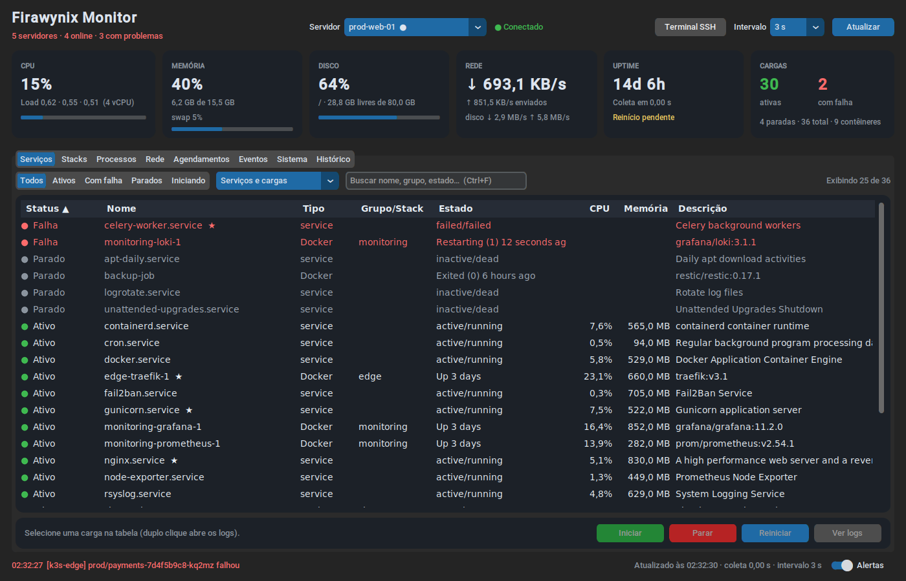

## Recursos

| Área | O que faz |
|---|---|
| **Visão geral** | Todos os servidores lado a lado (saúde, CPU, memória, disco, load, rede, **latência**, uptime, cargas ativas/falhas, contêineres/pods/VMs, **nota de segurança**, alertas) e uma lista única de **problemas em todos os servidores** (cargas, endpoints fora do ar, discos com SMART ruim, falhas críticas de segurança); duplo clique leva ao item |
| **Contêineres** | Painel próprio e **idêntico para qualquer motor** (Docker, Podman, containerd/nerdctl, CRI-O/containerd via crictl, Buildah, Skopeo): **auto-detecção** dos motores instalados (versão, rootless, estado do daemon) ou escolha manual no botão **Motores…**; contêineres com imagem, portas, stack/pod, CPU e memória; **imagens** (tamanho, uso, órfãs) com **verificação de atualizações no registro via Skopeo** (sem baixar nada); **volumes** (em uso ou não), **redes** (sub-redes, contêineres), **builds do Buildah** e **uso de disco** (`system df`). Ações: iniciar/parar/reiniciar, **pausar/retomar**, logs, **console** (shell no contêiner via `ssh -t`), inspecionar e — com `container_admin` — remover contêineres parados, imagens, volumes e **limpar imagens órfãs**. Painéis web de terceiros (**Portainer**, Cockpit, Dockge, Yacht, Dozzle, Rancher, Watchtower) são **detectados** e abertos no navegador, sem mudar o layout |
| **Mudanças seguras** | Parar, iniciar, reiniciar, pausar, remover, **criar** e **restaurar** qualquer contêiner com o mesmo fluxo: **análise de risco** (nenhum → crítico) e **o que pode ser afetado** antes de executar — portas e sites que saem do ar, contêineres que dependem dele (Compose `depends_on`), papel (banco, proxy, túnel/VPN de acesso, painel), dados gravados dentro do contêiner, política de reinício, conflitos de porta e de nome, memória/disco, riscos de segurança de um contêiner novo (privileged, `docker.sock`, rede do host). **Proteções**: definição salva neste PC (criptografada com DPAPI), **snapshot** (`commit`) e **backup dos volumes com o contêiner parado**; depois, parada graciosa, verificação (parou? subiu e ficou estável? entrou em loop?) e registro no **histórico de mudanças** com *Iniciar novamente* e *Restaurar*. Contêiner que derrubaria a conexão do próprio painel (túnel/VPN) é **crítico** e exige digitar o nome |
| **Conexões** | Botão **Conexões**: adicionar, editar e remover servidores sem abrir o JSON — autenticação (chave, chave + passphrase, usuário e senha, **chave + senha (2FA)**, agente) e **conector** (direto, **VPN**, **Cloudflare Tunnel**, **host de salto**, **proxy SOCKS5/HTTP**, comando). **Testar conexão** conecta de verdade; **Salvar e aplicar** valida tudo, guarda o `.bak` e aplica **sem reiniciar**. Senhas: Gerenciador de Credenciais ou **pedir ao conectar** (só em memória) |
| **Serviços** | Unidades systemd (`service`, `timer`, `socket`, `mount`, `path`), contêineres de todos os motores, **instâncias LXD/Incus** (contêineres e VMs), pods Kubernetes e VMs libvirt em uma só tabela, com CPU/memória por serviço (cgroup v2), por contêiner (`stats`) e por instância LXD; filtros por status e tipo, busca e ordenação |
| **Stacks** | Projetos do Docker/Podman **Compose**, pods do Podman e namespaces do Kubernetes, com status agregado (ativo/degradado/falha), membros, diretório/arquivos do Compose e ações na stack inteira |
| **Processos** | Top N por CPU (CPU instantânea via `/proc`), memória, RSS, tempo, linha de comando; encerrar com TERM/KILL (desativado por padrão) |
| **Rede** | Taxas por interface (física/virtual), portas em escuta com processo e exposição (todas as interfaces / local), conexões TCP/UDP |
| **VPS** | Plataforma/provedor (DigitalOcean, Hetzner, Vultr, AWS, Azure, Google, OVH, Contabo, OpenStack, Proxmox…), **CPU steal** e iowait, **latência Windows → servidor**, relógio/**NTP** (e desvio do chrony), DNS, gateway, IPs públicos/privados, swap e *swappiness*, **OOM killer** (24 h), **tráfego do mês e franquia** (vnStat) e **endpoints**: sites/APIs (status HTTP, latência) e **certificados TLS** (validade, emissor, dias para expirar) verificados a partir do Windows |
| **Segurança** | **Nota de 0 a 100** e verificações com explicação e recomendação: login do root e por senha no SSH (configuração efetiva, com `Include`), chaves autorizadas fracas, firewall (UFW, firewalld, nftables, iptables), **serviços sensíveis expostos** (Redis, bancos, API do Docker… inclusive portas do Docker que ignoram o UFW), fail2ban/CrowdSec, tentativas de login, atualizações de segurança e automáticas, reinício pendente, AppArmor/SELinux, *hardening* do kernel (sysctl), contas com UID 0, sudo negado, `/tmp`, NTP, auditd. Abas de **tentativas SSH por IP** (com **banir**), **fail2ban** (com **desbanir**), **logins aceitos**, **uso de sudo**, sessões abertas e chaves autorizadas (tipo, bits, impressão digital) |
| **Agendamentos** | Timers do systemd (próxima/última execução) e entradas de cron (usuário, `/etc/crontab`, `/etc/cron.d`, `cron.daily`…) |
| **Eventos** | Erros do journal nas últimas N horas (`journalctl -p err -o json`), com busca e detalhes |
| **Sistema** | SO, kernel, CPU, virtualização, boot, IPs, reinício pendente, **atualizações pendentes** (apt/dnf/yum/apk/zypper, só cache local), falhas de login SSH (24 h), temperaturas, discos com uso de **inodes**, E/S por disco, **saúde SMART** (ATA e NVMe: aprovado/reprovado, setores realocados/pendentes, desgaste, temperatura, horas ligado) e estado de cada runtime |
| **Histórico** | Gráficos de CPU/memória/disco, load, rede, E/S de disco, **CPU steal/iowait** e **latência** (15 min a 7 dias), gravados em SQLite local; crosshair com tooltip e exportação CSV |
| **Ações** | Iniciar/Parar/Reiniciar (unidades, contêineres, instâncias LXD, VMs), reiniciar pod (recriar), ações em stacks inteiras, **banir/desbanir IP no fail2ban**, logs/detalhes em janela modal, **Terminal SSH** em um clique |
| **Alertas** | Toasts do Windows quando um item crítico falha/recupera, um servidor cai ou volta, **CPU/memória/disco/steal/latência** passam do limite, um **site sai do ar** ou um **certificado vai expirar**, um **disco degrada**, surge uma **falha crítica de segurança**, o **root faz login**, o **OOM killer** age ou a **franquia de tráfego** chega a 80%/100%; ícone na bandeja muda de cor |
| **API do Windows** | Senhas SSH no **Gerenciador de Credenciais** (DPAPI), alertas e ações no **Visualizador de Eventos**, **barra de título** na cor do tema (Windows 11), **piscar a barra de tarefas** em alertas críticos, **iniciar com o Windows**, **impedir a suspensão** e **ping ICMP** sem administrador |
| **Exportação** | Qualquer tabela para CSV (botão direito → *Exportar tabela*), pronto para o Excel |
| **Resiliência** | Uma thread por servidor, coletores em paralelo, reconexão com *exponential backoff*, **timeout máximo de 5 s por comando**, keepalive e watchdog; endpoints verificados em segundo plano |

| Contêineres (Docker + Portainer detectado) | Imagens (atualizações via Skopeo) | Motores: auto-detectar ou escolher |
|---|---|---|
| 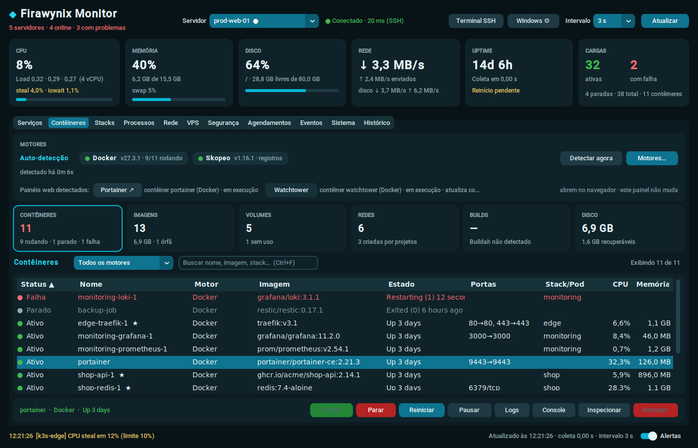 | 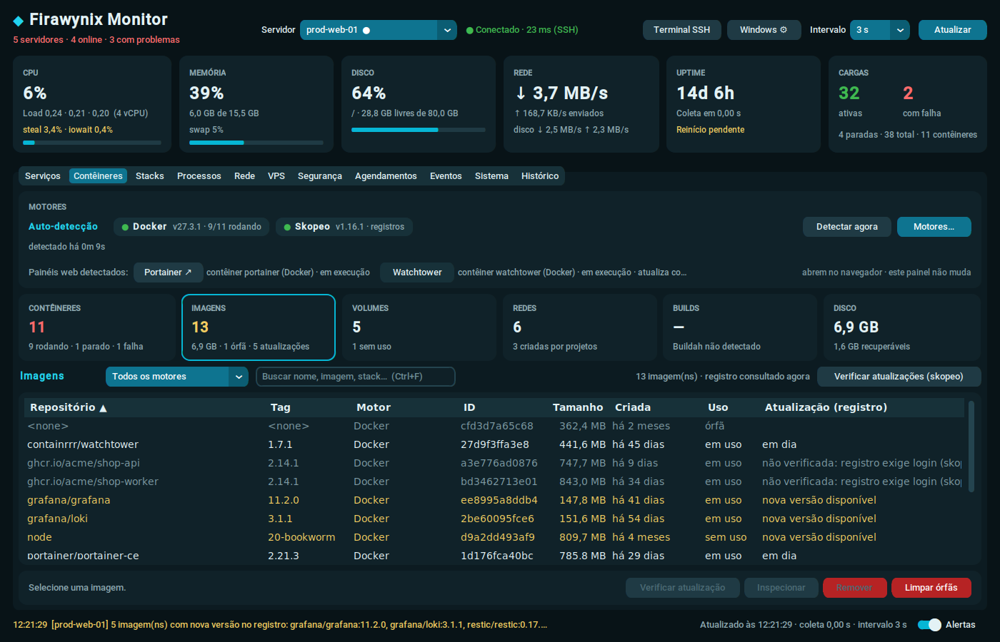 | 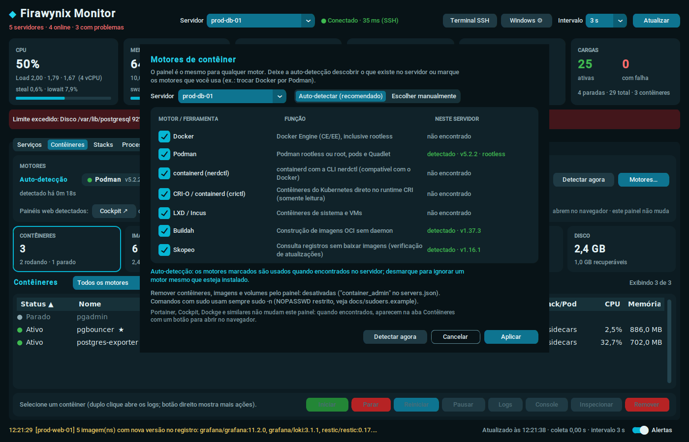 |

| Visão geral | Segurança | VPS |
|---|---|---|
| 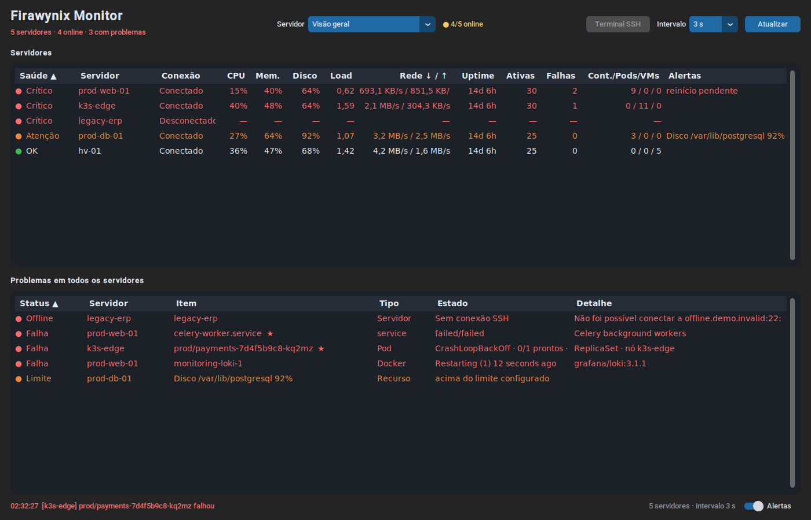 | 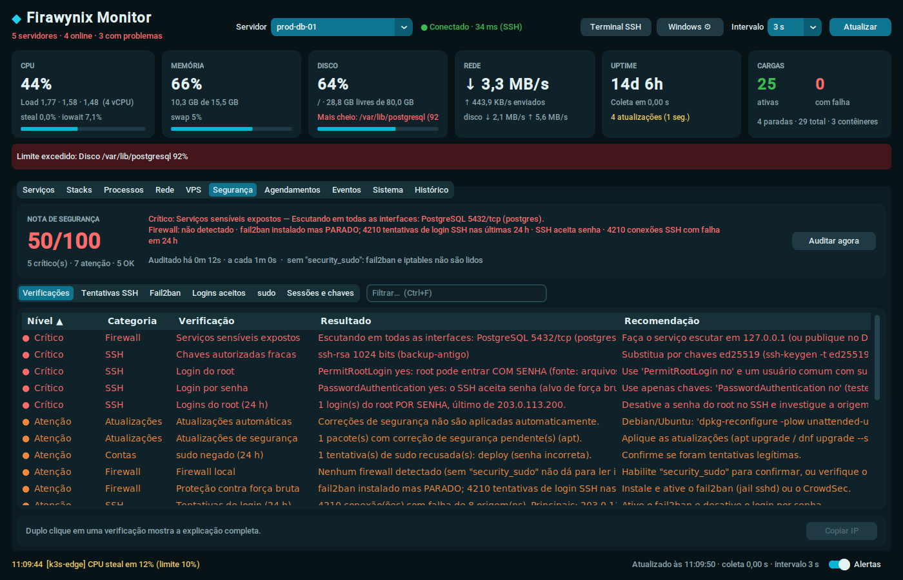 | 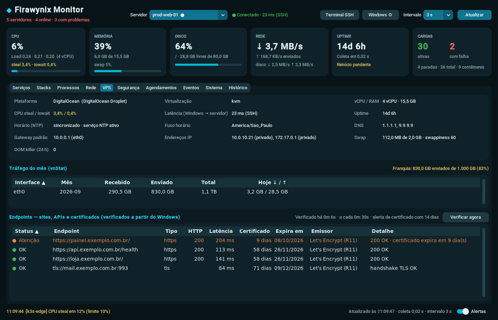 |

| Histórico | Sistema (SMART) | Tema claro |
|---|---|---|
| 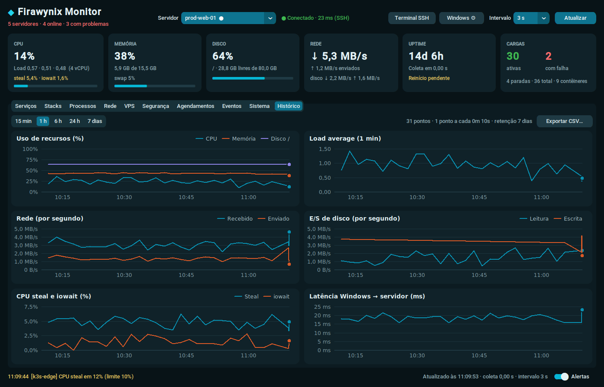 | 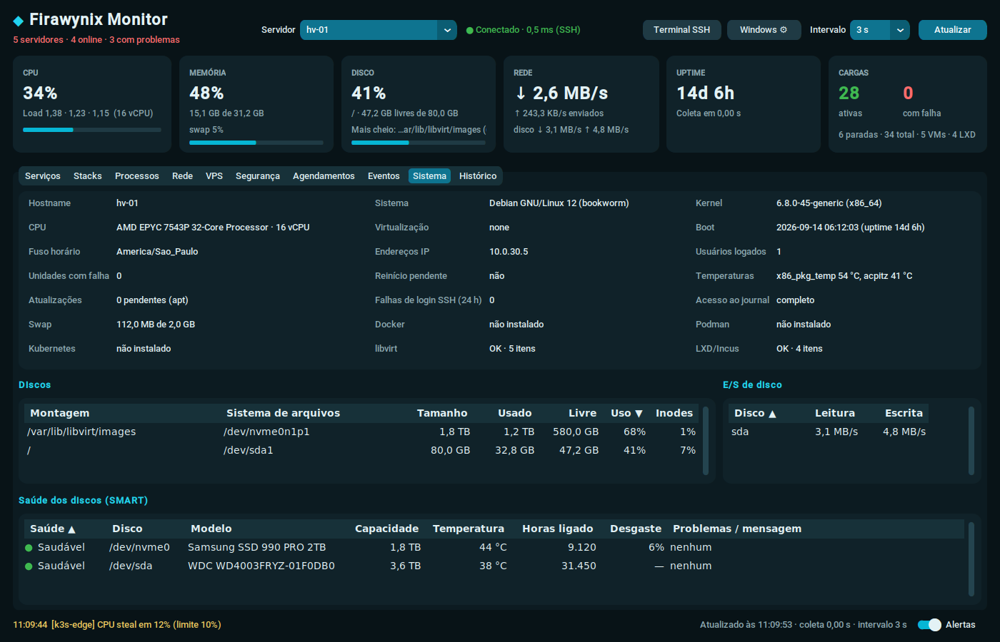 | 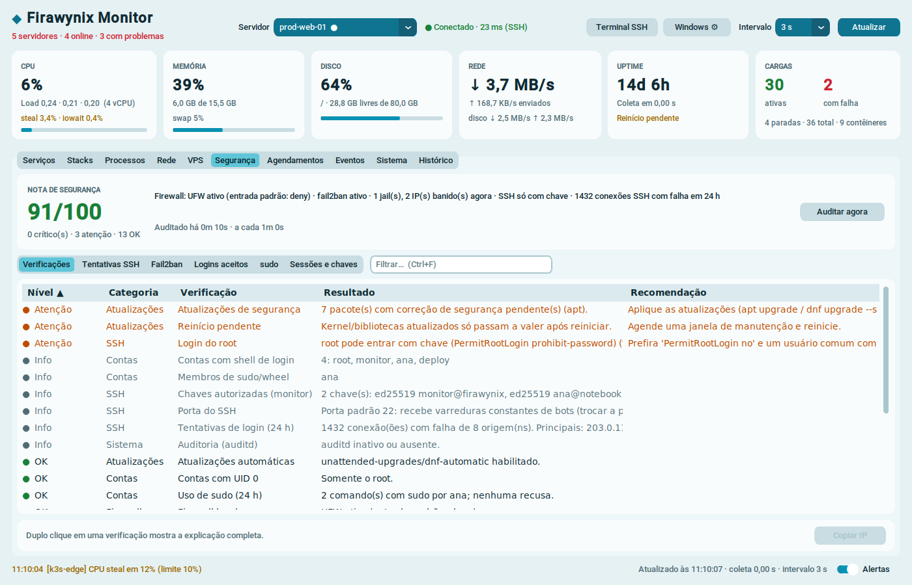 |

| Mudança segura: risco, impacto e proteções | Histórico de mudanças (iniciar/restaurar) | Servidores e conexões |
|---|---|---|
| 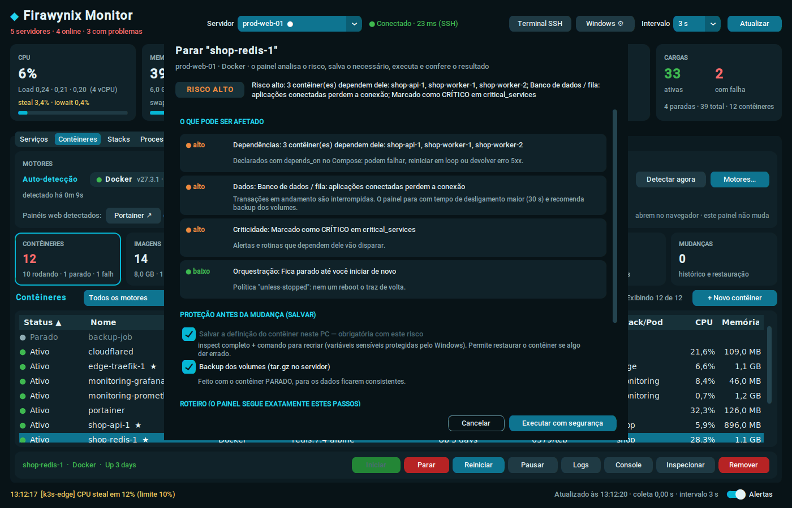 | 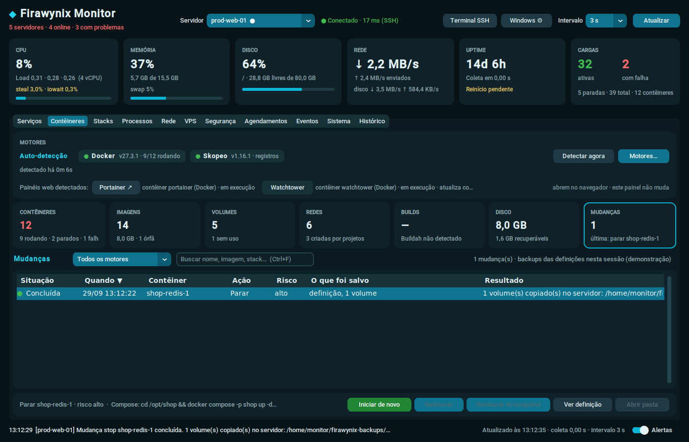 | 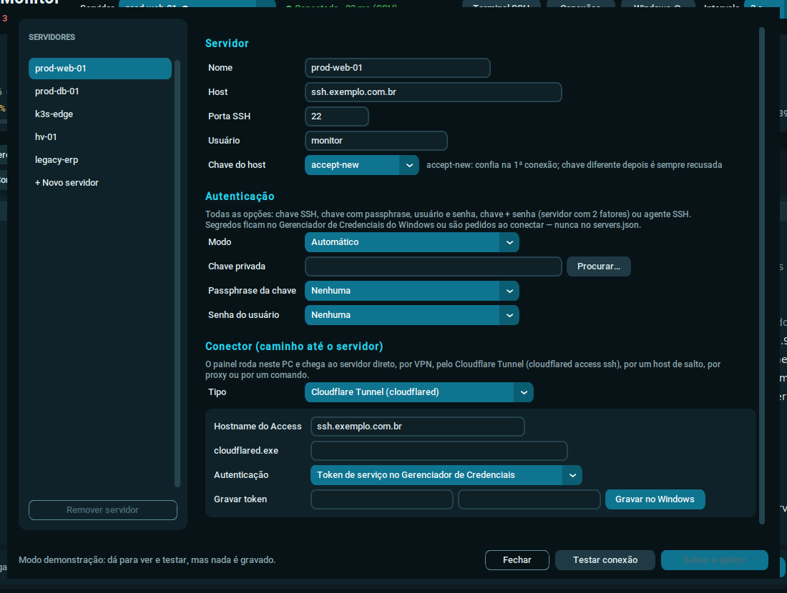 |

## Arquitetura

```
firawynix-monitor/
├── main.py                 # ponto de entrada: CLI, logging, instância única, ciclo de vida
├── config/
│   ├── settings.py         # carrega e valida servers.json (+ .env / Gerenciador de Credenciais)
│   └── preferences.py      # preferências alteradas pela interface (preferences.json)
├── core/
│   ├── models.py           # dataclasses imutáveis (cargas, stacks, métricas, VPS, segurança, eventos)
│   ├── commands.py         # construtores de comandos remotos (validação + shlex.quote + sudo -n)
│   ├── containers.py       # motores de contêiner: registro, auto-detecção, adaptadores (docker, podman,
│   │                       #   nerdctl, crictl, buildah, skopeo), inventário unificado, painéis de terceiros
│   ├── parsers.py          # parsers de systemctl, docker/podman, incus/lxc, kubectl, virsh, /proc, ss,
│   │                       #   sshd, fail2ban, journal, smartctl, vnStat, cron…
│   ├── security.py         # regras da auditoria de segurança e nota 0–100
│   ├── endpoints.py        # HTTP, certificados TLS e portas TCP verificados a partir do Windows
│   ├── alerts.py           # alertas de endpoints, SMART, segurança, logins, OOM e franquia
│   ├── winapi.py           # API do Windows via ctypes (credenciais, eventos, DWM, ICMP…)
│   ├── ssh_client.py       # conexão Paramiko, execução com timeout rígido, operações de alto nível
│   ├── monitor.py          # ServerMonitor (thread por servidor, camadas de coleta), MonitorManager
│   ├── history.py          # histórico em SQLite com retenção, agregação e migração
│   ├── notifier.py         # toasts do Windows com fallback e cooldown
│   └── demo.py             # servidores simulados (--demo)
├── ui/
│   ├── dashboard.py        # janela principal, cartões, eventos, alertas, bandeja, terminal
│   ├── tabs.py             # Serviços, Stacks, Processos, Rede, Agendamentos, Eventos, Sistema, Histórico
│   ├── containers_tab.py   # aba Contêineres (a mesma para qualquer motor)
│   ├── engines_dialog.py   # diálogo "Motores…" (auto-detectar ou escolher)
│   ├── vps_tab.py          # aba VPS (provedor, NTP, tráfego, endpoints)
│   ├── security_tab.py     # aba Segurança (nota, verificações, fail2ban, logins, sudo, chaves)
│   ├── options.py          # diálogo "Windows ⚙" (integrações e credenciais)
│   ├── theme.py            # tokens do tema ciano (claro/escuro) e barra de título
│   ├── themes/cyan.json    # tema do CustomTkinter
│   ├── widgets.py          # tabela genérica, cartões, diálogos, visualizador de texto, gráfico de linhas
│   └── tray.py             # ícone da bandeja e geração dos ícones
├── tests/                  # pytest
├── docs/sudoers.example    # regras NOPASSWD restritas
├── FirawynixMonitor.spec   # PyInstaller
├── scripts/build.ps1       # build do .exe em um comando
├── requirements.txt        # dependências de execução congeladas
└── requirements-dev.txt    # + testes e empacotamento (também congeladas)
```

### Coleta em camadas

Cada ciclo executa **em paralelo** (canais SSH distintos na mesma conexão) os coletores
que estiverem vencidos. Cada comando continua limitado a 5 s.

| Camada | Frequência (padrão) | O que coleta |
|---|---|---|
| Rápida | `poll_interval_seconds` (5 s) | unidades systemd, CPU/memória por serviço (cgroup v2), contêineres de cada motor detectado, LXD/Incus, pods, VMs, métricas do host (CPU, steal, iowait, load, memória, discos, rede, E/S) e latência |
| Detalhes | `detail_interval_seconds` (15 s) | processos, portas, `stats` dos contêineres |
| Inventário | `inventory_interval_seconds` (60 s) | **auto-detecção dos motores**, imagens/volumes/redes/uso de disco de cada motor, builds do Buildah, sistema, VPS (provedor, NTP, DNS, OOM killer, vnStat), timers, cron, eventos do journal |
| Segurança | `security_interval_seconds` (5 min) | auditoria (sshd, firewall, contas, sysctl…), fail2ban, logins SSH, sudo, SMART |
| Atualizações | `updates_interval_seconds` (30 min) | pacotes pendentes (somente cache local, nunca acessa a rede) |
| Endpoints | `endpoint_interval_seconds` (60 s) | sites/APIs, certificados e portas, **a partir do Windows** e em segundo plano (um site lento nunca atrasa a coleta SSH) |

"Atualizar" (F5) força todas as camadas. Runtimes ausentes em modo `auto` (ex.: servidor
sem Kubernetes) são re-testados só a cada 12 ciclos.

**Latência:** no Windows, `IcmpSendEcho` (ping sem administrador); se o servidor não
responder a ICMP, o monitor usa o tempo de abertura de canal SSH (um ida-e-volta na
conexão já aberta, sem processo nem linha de log no servidor — nada de conexões TCP
extras que o fail2ban poderia punir).

**Tentativas de login:** agregadas no próprio servidor com `awk` (VPS expostos recebem
dezenas de milhares por dia): uma linha por IP de origem, cada conexão contada uma vez,
compatível com o `sshd-session` do OpenSSH 9.8+. Testado com mawk, gawk e busybox.

### Fluxo de dados e threads

```
 ┌──────────────── thread por servidor ─────────────────┐
 │ ServerMonitor: conecta (backoff) → coleta em paralelo │──┐  eventos
 │ → compara → alertas → histórico (SQLite)             │  │ (queue.Queue)
 └──────────────────────────────────────────────────────┘  │
 ┌──────── pool de sondas (sem SSH): endpoints, ICMP ─────┐  │
 └──────────────────────────────────────────────────────┘  │
 ┌──────────── ThreadPoolExecutor (ações e logs) ────────┐  │
 │ start/stop/restart, stacks, kill, fail2ban, logs      │──┤
 └──────────────────────────────────────────────────────┘  ▼
                                   Dashboard._pump() a cada 100 ms (thread da UI)
 pystray (thread própria) ── call_in_ui() ───────────────▲
```

* A interface **nunca** executa SSH: ela só consome eventos e *futures*. Só a aba visível
  é redesenhada.
* Um comando que passa de 5 s é abortado; os dados anteriores continuam na tela com
  aviso. Três ciclos seguidos com timeout nos coletores rápidos derrubam a conexão e o
  monitor reconecta. Um *watchdog* fecha o transporte se o servidor travar no meio do
  protocolo SSH.
* Falhas de autenticação ou de chave de host usam backoff longo (30 s → 10 min) para não
  disparar o fail2ban. Salvar uma nova credencial reconecta na hora.
* Os alertas disparam só na **transição** e a primeira leitura vira a linha de base:
  abrir o monitor não despeja o histórico das últimas 24 h em notificações.

## Requisitos

* Windows 10 ou 11 (x64). As cores da barra de título exigem o Windows 11.
* Python **3.11+** (todas as dependências têm wheels Windows para 3.11–3.14) — apenas
  para rodar a partir do código-fonte ou gerar o `.exe`
* Nos servidores: OpenSSH e `systemd`. Docker, Podman, LXD/Incus, Kubernetes, libvirt,
  `ss`, `crontab`, `smartctl` (pacote *smartmontools*), `vnstat`, fail2ban etc. são
  detectados automaticamente e usados quando existirem. Nada é instalado neles.
* Para o botão **Terminal SSH**: o *Cliente OpenSSH* do Windows (já vem no Windows 10
  1809+ e 11). Com o Windows Terminal instalado, abre uma nova aba nele.

## Instalação (código-fonte)

```powershell
git clone https://github.com/firawynix/firawynix-monitor.git
cd firawynix-monitor
py -3.12 -m venv .venv
.\.venv\Scripts\Activate.ps1
python -m pip install --upgrade pip
pip install -r requirements.txt

Copy-Item servers.example.json servers.json   # edite com seus servidores
python main.py
```

Quer só conhecer a interface? `python main.py --demo` usa cinco servidores simulados
(web em DigitalOcean com stacks Compose, fail2ban e endpoints; banco na Hetzner com
problemas de segurança e um disco degradado; cluster k3s na Vultr com CPU steal alto e um
site fora do ar; hipervisor com VMs, LXD/Incus e SMART; e um servidor offline) e
histórico de exemplo.

### Opções de linha de comando

| Opção | Efeito |
|---|---|
| `--config CAMINHO` | Usa outro `servers.json` |
| `--minimized` | Inicia oculto na bandeja (usado pela inicialização com o Windows) |
| `--demo` | Servidores simulados, sem SSH |
| `--debug` | Log detalhado |
| `--set-credential SERVIDOR` | Pede a senha SSH (sem eco, no console — use com `python main.py`) e a grava no Gerenciador de Credenciais do Windows. No `.exe`, use o botão **Windows ⚙** |
| `--delete-credential SERVIDOR` | Remove a credencial |
| `--passphrase` | Com as duas opções acima: passphrase da chave em vez da senha |
| `--version` | Mostra a versão |

## Configuração

### Onde fica o `servers.json`

Procurado nesta ordem: `--config` → variável `FIRAWYNIX_CONFIG` → pasta do executável
(ou raiz do projeto) → pasta atual → `%APPDATA%\FirawynixMonitor\servers.json`.

O arquivo completo está em [`servers.example.json`](servers.example.json). Chaves
desconhecidas geram erro (um `"usename"` digitado errado não passa despercebido) e todos
os problemas são listados de uma vez ao iniciar.

### `settings`

| Campo | Padrão | Descrição |
|---|---|---|
| `poll_interval_seconds` | `5` | Camada rápida (2–3600 s). Também pode ser trocado na interface |
| `detail_interval_seconds` | `15` | Processos, portas e stats de contêineres |
| `inventory_interval_seconds` | `60` | Sistema, VPS, timers, cron, eventos |
| `security_interval_seconds` | `300` | Auditoria de segurança, fail2ban, logins, sudo e SMART |
| `updates_interval_seconds` | `1800` | Contagem de atualizações pendentes |
| `endpoint_interval_seconds` | `60` | Verificação dos `endpoints` (a partir do Windows) |
| `cert_warning_days` | `14` | Certificados que expiram em até N dias ficam em "Atenção" e geram alerta (uma vez por dia) |
| `latency_probe` | `"auto"` | `auto` (ICMP no Windows, senão SSH), `icmp`, `ssh` ou `off` |
| `command_timeout_seconds` | `5` | Timeout de cada comando SSH. **Máximo 5** |
| `connect_timeout_seconds` | `5` | Timeout de conexão/handshake/autenticação |
| `minimize_to_tray` | `true` | Fechar a janela mantém o monitor na bandeja |
| `start_minimized` | `false` | Inicia oculto na bandeja |
| `appearance_mode` | `"dark"` | `dark`, `light` ou `system` (tema ciano nos dois modos) |
| `log_lines` | `50` | Linhas iniciais no modal de logs |
| `process_limit` | `200` | Quantos processos (top por CPU) exibir |
| `known_hosts_file` | `%LOCALAPPDATA%\FirawynixMonitor\known_hosts` | Onde as chaves de host aceitas são gravadas |
| `notifications.enabled` | `true` | Liga/desliga os toasts |
| `notifications.notify_on_recovery` | `true` | Avisa quando algo se recupera |
| `notifications.notify_on_disconnect` | `true` | Avisa quando um servidor fica inacessível |
| `notifications.alert_on_stop` | `false` | Também alerta quando um item crítico **para** (sem falhar). Paradas feitas pelo próprio monitor não geram alerta |
| `notifications.security_alerts` | `true` | Alerta novas falhas **críticas** de segurança |
| `notifications.notify_on_ssh_login` | `"root"` | Logins SSH que geram alerta: `root`, `all` (qualquer usuário) ou `off`. As reconexões do próprio monitor são ignoradas |
| `notifications.cooldown_seconds` | `120` | Intervalo mínimo entre alertas iguais |
| `notifications.app_id` | — | AppUserModelID dos toasts (opcional) |
| `thresholds.cpu_percent` / `mem_percent` / `disk_percent` | `90` | Limites de alerta (0 desativa) |
| `thresholds.steal_percent` | `10` | CPU "roubada" pelo hipervisor — VPS com vizinhos barulhentos (0 desativa) |
| `thresholds.latency_ms` | `0` | Latência Windows → servidor (0 desativa) |
| `thresholds.sustain_polls` | `3` | Coletas seguidas acima do limite antes de alertar (disco alerta na hora). Só "normaliza" 5 pontos (10% na latência) abaixo do limite |
| `history.enabled` / `retention_days` / `file` | `true` / `7` / `%LOCALAPPDATA%\…\history.sqlite3` | Histórico dos gráficos (bancos antigos são migrados automaticamente) |
| `events.priority` | `"err"` | Prioridade máxima dos eventos do journal (`emerg`…`notice`) |
| `events.limit` / `events.since_hours` | `100` / `24` | Quantidade e janela dos eventos |
| `windows.event_log` | `true` | Alertas e ações no Visualizador de Eventos |
| `windows.flash_taskbar` | `true` | Pisca a barra de tarefas em alertas críticos |
| `windows.prevent_sleep` | `false` | Impede a suspensão do PC enquanto o monitor estiver aberto |
| `windows.accent_title_bar` | `true` | Barra de título com a cor do tema (Windows 11) |

As opções `windows.*` também podem ser trocadas no botão **Windows ⚙**; a escolha feita
na interface fica em `%APPDATA%\FirawynixMonitor\preferences.json` e tem prioridade.

### `servers[]`

| Campo | Padrão | Descrição |
|---|---|---|
| `name` | — | Nome exibido (único) |
| `host` / `port` | — / `22` | Endereço SSH |
| `username` | — | Usuário SSH (recomendado: usuário dedicado, ex. `monitor`) |
| `auth` | `"auto"` | Modo de autenticação: `auto`, `key`, `password`, `key+password` (2 fatores) ou `agent` — veja [Conectores e autenticação](#conectores-e-autenticação) |
| `key_file` | — | Chave privada (`~` e `%VAR%` são expandidos). Sem ela, usa o agente SSH e as chaves padrão de `~/.ssh` |
| `key_passphrase_env` / `password_env` | — | **Nome** da variável de ambiente com a passphrase / senha |
| `key_passphrase_credential` / `password_credential` | — | `true` (nome padrão `FirawynixMonitor/<servidor>` ou `…/<servidor>/passphrase`) ou o nome de uma credencial genérica do **Gerenciador de Credenciais do Windows** |
| `key_passphrase_prompt` / `password_prompt` | `false` | **Pedir ao conectar**: o painel pergunta e guarda só na memória até fechar |
| `connector` | direto | Caminho até o servidor: `vpn`, `cloudflared`, `jump`, `socks5`, `http` ou `command` (objeto com os campos do tipo; veja abaixo) |
| `allow_agent` / `look_for_keys` | `true` | Usa o agente (OpenSSH do Windows / Pageant) e as chaves padrão |
| `host_key_policy` | `"accept-new"` | `accept-new` (TOFU, como o OpenSSH) ou `strict`. Chave **diferente** da gravada é sempre recusada |
| `unit_types` | todos | Tipos de unidade systemd coletados: `service`, `timer`, `socket`, `mount`, `path` |
| `use_sudo` | `true` | `sudo -n` para iniciar/parar/reiniciar unidades (ignorado se `username` for `root`) |
| `docker` / `docker_sudo` | `"auto"` / `false` | `auto` (usa se a auto-detecção encontrar), `on` (sempre; avisa se indisponível) ou `off`; sudo para o Docker. A escolha feita em **Motores…** tem prioridade |
| `podman` / `podman_sudo` | `"auto"` / `false` | Idem para o Podman (rootless funciona sem sudo) |
| `nerdctl` / `nerdctl_sudo` / `nerdctl_namespace` | `"auto"` / `false` / `""` | containerd via `nerdctl` (ex.: `"k8s.io"` para ver os contêineres do k3s) |
| `cri` / `cri_sudo` | `"auto"` / `false` | Contêineres do Kubernetes direto no runtime CRI (CRI-O/containerd) via `crictl` — somente leitura; costuma exigir root |
| `buildah` / `buildah_sudo` | `"auto"` / `false` | Builds em andamento (contêineres de trabalho) e imagens do Buildah |
| `skopeo` | `"auto"` | Verificação de atualizações de imagens direto no registro (sem baixar) |
| `container_admin` | `false` | Permite **remover** contêineres (o fluxo seguro para antes, com snapshot), imagens, volumes, limpar imagens órfãs, **criar** contêineres novos e **restaurar** contêineres removidos |
| `lxd` / `lxd_sudo` | `"auto"` / `false` | Instâncias LXD/Incus (`incus` ou `lxc`, inclusive snap) |
| `kubernetes` | `"auto"` | Pods via `kubectl` |
| `kubectl_command` | `"kubectl"` | Ex.: `"k3s kubectl"`, `"microk8s kubectl"` ou caminho absoluto |
| `kubectl_sudo` | `false` | Necessário no k3s (kubeconfig só legível pelo root) |
| `libvirt` / `libvirt_uri` / `libvirt_sudo` | `"auto"` / `"qemu:///system"` / `false` | VMs via `virsh` |
| `smart` / `smart_sudo` | `"auto"` / `false` | Saúde SMART dos discos (o `smartctl` exige root: habilite `smart_sudo`) |
| `security` | `true` | Auditoria de segurança (somente leitura) |
| `security_sudo` | `false` | `sudo -n` para `sshd -T`, `ufw status`, `iptables -S INPUT`, `nft list ruleset` e `fail2ban-client status` |
| `security_actions` | `false` | Banir/desbanir IPs no fail2ban pela interface (exige `security_sudo`) |
| `endpoints` | `[]` | Sites/APIs/portas verificados a partir do Windows: `https://…`, `http://…`, `tls://host:porta`, `tcp://host:porta` (credenciais na URL são recusadas) |
| `bandwidth_quota_gb` / `bandwidth_count` | — / `"tx"` | Franquia mensal do provedor (GB) e o que ela conta: `tx` (enviado, o comum em VPS) ou `total` |
| `logs_sudo` | `false` | `sudo -n` com o `journalctl` |
| `network_sudo` | `false` | `sudo -n ss -tulnp` para ver o processo dono de todas as portas |
| `process_actions` | `false` | Habilita encerrar processos (TERM/KILL) |
| `process_sudo` | `false` | `sudo -n kill` (**não recomendado**: permite encerrar qualquer processo) |
| `poll_interval_seconds` | global | Intervalo específico deste servidor |
| `critical_services` | `["*"]` | Padrões *glob* dos itens que geram alerta. `nginx` casa com `nginx.service`; prefixos restringem o tipo: `systemd:`, `docker:`, `podman:`, `nerdctl:` (ou `containerd:`), `cri:`, `lxd:` (ou `incus:`), `k8s:` (ex.: `k8s:prod/*`), `vm:` |
| `exclude_services` | `[]` | Padrões ocultados da tabela e dos alertas |

### Segredos

Senhas e passphrases **nunca** ficam no `servers.json` — chaves como `password`,
`passphrase` ou `sudo_password` são recusadas. Há duas formas seguras:

1. **Gerenciador de Credenciais do Windows** (recomendado no Windows): use
   `"password_credential": true` e grave a senha pelo botão **Windows ⚙ → Credenciais**,
   com o próprio Windows — `cmdkey /generic:FirawynixMonitor/<servidor> /user:<usuario> /pass`
   (pede a senha) — ou, rodando pelo código-fonte, `python main.py --set-credential <servidor>`. O
   segredo fica criptografado pelo Windows (DPAPI) para o seu usuário e nunca aparece em
   arquivo ou log.
2. **Variável de ambiente**: `"password_env": "NOME"` e o valor nas variáveis do Windows
   ou em um `.env` ao lado do `servers.json`/executável (veja [`.env.example`](.env.example)).

## Conectores e autenticação

O painel roda **no seu PC** e chega ao servidor pelo caminho escolhido em `connector`
(ou no botão **Conexões**). O SSH é sempre ponta a ponta: o conector só transporta os
bytes, e a chave do host continua sendo verificada.

| `connector.type` | Campos | Como funciona |
|---|---|---|
| (omitido) / `direct` | — | Conexão TCP direta ao `host:port` |
| `vpn` | `name`, `check` (`host:porta`, padrão = o próprio servidor), `up_command` (opcional, lista de argumentos) | Testa se a rota da VPN responde antes de conectar. Se não responder e houver `up_command` (ex.: `wireguard.exe /installtunnelservice …`, `tailscale up`, `rasdial …`), roda **uma vez** (no máximo a cada 2 min) e espera a rota subir até 20 s. Sem comando, explica que a VPN precisa ser ligada |
| `cloudflared` | `hostname` (padrão = `host`), `destination`, `cloudflared_path`, `service_token_credential` **ou** `service_token_id_env` + `service_token_secret_env` | Túnel pelo **Cloudflare Access** com `cloudflared access ssh --hostname …` (como o `ProxyCommand` do OpenSSH, mas sem janela de console). Com **token de serviço** (Client ID/Secret no Gerenciador de Credenciais ou em variáveis), nada é pedido; sem token, use **Entrar no Cloudflare Access** (login no navegador uma vez; o painel **não** abre o navegador sozinho a cada reconexão) |
| `jump` | `host`, `port`, `username`, `auth`, `key_file`, `password_*`, `key_passphrase_*` | Host de salto (bastion), como `ssh -J`: o painel autentica no bastion e abre um canal `direct-tcpip` até o servidor. O bastion tem autenticação própria (credencial `FirawynixMonitor/<servidor>/jump`) |
| `socks5` | `host`, `port` (1080), `username`, `password_env`/`password_credential` | Proxy SOCKS5 (RFC 1928/1929); o nome do servidor é resolvido pelo proxy |
| `http` | `host`, `port` (3128), `username`, `password_env`/`password_credential` | Proxy HTTP `CONNECT` (autenticação Basic) |
| `command` | `command` (lista de argumentos; `%h` host, `%p` porta, `%r` usuário) | Qualquer `ProxyCommand` que fale pelo stdin/stdout (ex.: `ncat --proxy …`, `ssh -W %h:%p bastion`) |

**Autenticação** (`auth`), todas com as mesmas fontes de segredo (Gerenciador de
Credenciais, variável de ambiente ou pedir ao conectar):

| `auth` | Usa | Quando |
|---|---|---|
| `auto` (padrão) | chave (arquivo, `~/.ssh`, agente) e, se houver, a senha | Compatível com as versões anteriores |
| `key` | chave privada (com passphrase, se tiver) | O recomendado |
| `password` | usuário e senha (também responde ao *keyboard-interactive*) | Servidores sem chave |
| `key+password` | chave **e depois** senha | sshd com `AuthenticationMethods publickey,password` (2 fatores) |
| `agent` | só o agente SSH (OpenSSH do Windows / Pageant) | Chaves que nunca saem do agente |

Quando algo falta — senha "pedir ao conectar", passphrase ou login no Cloudflare —, o
painel **pergunta uma vez** (ou avisa pela bandeja, se estiver minimizado) em vez de
tentar de novo sem parar. Erros de autenticação dizem o que o servidor aceita (ex.: "o
servidor também exige senha (2 fatores): use Chave SSH + senha"). O **Terminal SSH** segue
o mesmo conector (`-J` para salto e `ProxyCommand` para Cloudflare/comando).

## Preparando os servidores Linux

1. **Usuário dedicado com chave:**

   ```bash
   sudo useradd -m -s /bin/bash monitor
   sudo -u monitor mkdir -m 700 -p ~monitor/.ssh
   # chave pública gerada no Windows com: ssh-keygen -t ed25519
   sudo -u monitor tee -a ~monitor/.ssh/authorized_keys < id_ed25519.pub
   sudo chmod 600 ~monitor/.ssh/authorized_keys
   ```

2. **Leitura sem sudo (preferível):**

   ```bash
   sudo usermod -aG systemd-journal monitor   # logs, eventos, logins SSH, sudo e OOM killer
   sudo usermod -aG libvirt monitor           # VMs (se houver)
   sudo usermod -aG docker monitor            # ATENÇÃO: grupo docker ≈ acesso root
   sudo apt install vnstat smartmontools      # opcional: franquia mensal e SMART
   sudo apt install skopeo                    # opcional: verificar atualizações de imagens
   ```

   Em vez do grupo `docker`, prefira `docker_sudo: true` com as regras **restritas** de
   [`docs/sudoers.example`](docs/sudoers.example) (leitura, ações, remoções e console em
   blocos separados — `docker run`, por exemplo, continua negado). O Podman rootless não
   precisa de nada.

3. **Ações e leituras privilegiadas sem senha, apenas para os comandos necessários** — o
   monitor usa `sudo -n` (não interativo) e **nunca** envia senha ao sudo. Crie
   `/etc/sudoers.d/firawynix-monitor` com `sudo visudo -f /etc/sudoers.d/firawynix-monitor`
   a partir de [`docs/sudoers.example`](docs/sudoers.example), que lista o comando exato
   de cada opção (serviços, auditoria, fail2ban, SMART, LXD…). Exemplo mínimo:

   ```sudoers
   Cmnd_Alias FWX_NGINX = /usr/bin/systemctl --no-block start nginx.service, \
                          /usr/bin/systemctl --no-block stop nginx.service, \
                          /usr/bin/systemctl --no-block restart nginx.service
   monitor ALL=(root) NOPASSWD: FWX_NGINX
   ```

   Ações usam `--no-block` (systemd) e `-t 3` (contêineres) para caber no limite de 5 s;
   o que demorar mais aparece como **Iniciando** na coleta seguinte. As **mudanças
   seguras** rodam passos longos (parada graciosa, snapshot, backup) em segundo plano no
   servidor e acompanham com comandos curtos, sem estourar o limite.

   **Backup dos volumes com `docker_sudo`/`podman_sudo`**: instale o script
   [`docs/firawynix-volume-backup`](docs/firawynix-volume-backup) e libere só ele no
   sudoers (em vez de um `docker run` genérico, que equivale a root):

   ```bash
   sudo install -o root -g root -m 0755 firawynix-volume-backup /usr/local/sbin/firawynix-volume-backup
   echo 'monitor ALL=(root) NOPASSWD: /usr/local/sbin/firawynix-volume-backup' | sudo tee /etc/sudoers.d/firawynix-backup
   sudo chmod 0440 /etc/sudoers.d/firawynix-backup && sudo visudo -c
   ```

   Os backups ficam em `/var/backups/firawynix` (0750, grupo do usuário do monitor).
   Sem sudo (grupo `docker` ou Podman rootless), ficam em `~/firawynix-backups`.

4. **CPU/memória por serviço** exigem cgroup v2 (Ubuntu 22.04+, Debian 11+, RHEL 9+);
   em cgroup v1 essas colunas ficam vazias e o resto funciona normalmente.

## Uso

* **Servidor**: *Visão geral* mostra todos; escolha um servidor para as abas. Um `●` ao
  lado do nome indica problema. Na visão geral, duplo clique em um servidor ou problema
  abre o item correspondente (endpoints abrem a aba VPS; segurança, a aba Segurança).
* **Tabelas**: clique nos cabeçalhos para ordenar; botão direito para ações, *Copiar
  linha* e *Exportar tabela (CSV)*. Duplo clique abre logs/detalhes.
* **Busca**: `Ctrl+F` na aba atual (`Esc` limpa). Vários termos são combinados com "E".
* **Segurança**: a nota soma as verificações (OK = 1, Atenção = ½, Crítico = 0; "Info" e
  "Indeterminado" não contam). Em *Tentativas SSH*, selecione um IP e **Banir** (vai para
  a jail `sshd` do fail2ban); em *Fail2ban*, **Desbanir**. O monitor nunca bane o próprio
  IP nem o loopback, e toda ação pede confirmação.
* **VPS**: *Verificar agora* refaz os endpoints; a franquia aparece quando
  `bandwidth_quota_gb` está definido e o vnStat está instalado.
* **Contêineres**: os blocos no topo (Contêineres, Imagens, Volumes, Redes, Builds,
  Disco) trocam a visão; o filtro *Todos os motores* restringe a um motor. Em *Imagens*,
  **Verificar atualizações (skopeo)** compara o digest local com o do registro — *nova
  versão disponível* significa que a tag foi republicada (atualize com `pull` + recriar o
  contêiner, ex.: `docker compose up -d`). **Console** abre um shell no contêiner no
  Windows Terminal (`ssh -t … exec -it`). **Motores…** escolhe entre auto-detecção e
  seleção manual (veja abaixo).
* **Mudanças em contêineres**: *Iniciar/Parar/Reiniciar/Pausar/Remover* e **+ Novo
  contêiner** abrem o diálogo de mudança (veja [Mudanças seguras](#mudanças-seguras-em-contêineres)).
  A visão **Mudanças** (aba Contêineres) lista o histórico com *Iniciar novamente*,
  *Restaurar*, *Restaurar do snapshot*, *Ver definição* e *Abrir pasta*.
* **Conexões**: adiciona/edita servidores, autenticação e conector; *Testar conexão* e
  *Salvar e aplicar* (sem reiniciar o painel).
* **Stacks**: selecione uma stack para ver os membros; as ações valem para todos os
  contêineres dela. Namespaces do Kubernetes são somente leitura aqui.
* **Pods**: *Reiniciar* exclui o pod para o controlador recriá-lo. Iniciar/Parar não se aplicam.
* **VMs**: *Parar* envia desligamento ACPI (`virsh shutdown`), nunca `destroy`.
* **Terminal SSH**: abre `ssh usuario@host` (com a chave e o conector configurados) no
  Windows Terminal ou em um console novo.
* **Windows ⚙**: liga/desliga as integrações com o Windows e grava credenciais.
* `F5` força uma coleta completa. O switch *Alertas* (e o menu da bandeja) silencia os toasts.
* **Bandeja**: fechar a janela mantém o monitor rodando. Verde = tudo OK, amarelo =
  avisos, vermelho = item crítico com falha, site fora do ar, disco falhando ou servidor
  inacessível, cinza = conectando. O menu também tem *Iniciar com o Windows*.
* **Logs da aplicação**: `%LOCALAPPDATA%\FirawynixMonitor\logs\monitor.log`.

## Motores de contêiner: auto-detecção e o mesmo painel para todos

O painel **não depende do motor**: Docker, Podman, containerd (nerdctl), CRI-O/containerd
(crictl), Buildah e Skopeo chegam no mesmo modelo (contêineres, imagens, volumes, redes,
builds e uso de disco) e aparecem com as mesmas colunas, filtros e botões. Trocar Docker
por Podman amanhã não muda nada na interface.

* **Auto-detectar (padrão)**: a cada ciclo de inventário o monitor procura os binários
  (`command -v`, inclusive `/usr/local/bin` e `/snap/bin`), a versão de cada um, o modo
  rootless do Podman, o Compose e os serviços (`docker`, `containerd`, `crio`,
  `podman.socket`) — um único comando SSH. Só os motores encontrados são consultados; um
  motor que some depois de funcionar gera aviso, um que nunca existiu fica em silêncio.
* **Escolher manualmente** (**Motores…** na aba Contêineres): marque os motores que o
  servidor usa. Os marcados são sempre consultados (com aviso se faltarem); os demais
  são ignorados. Na auto-detecção, desmarcar um motor faz o monitor ignorá-lo mesmo que
  esteja instalado. A escolha vale na hora, sem reiniciar, e fica em `preferences.json`
  (`engines.<servidor>`), com prioridade sobre o `servers.json`.
* **Painéis de terceiros não mudam o layout**: se o servidor roda Portainer, Cockpit,
  Dockge, Yacht, Dozzle ou Rancher (em contêiner ou como serviço), eles aparecem em
  *Painéis web detectados* com um botão que abre o endereço no navegador. O Watchtower é
  sinalizado porque atualiza contêineres sozinho.
* **O que cada motor oferece**:

| Motor | Contêineres | Ações | Imagens / volumes / redes | Observação |
|---|---|---|---|---|
| Docker | ✔ (Compose, portas, stats) | iniciar, parar, reiniciar, pausar, console, remover | ✔ + `system df` | `docker_sudo` com regras restritas ou grupo `docker` |
| Podman | ✔ (pods, Compose, rootless) | idem | ✔ + `system df` | rootless sem sudo |
| containerd (nerdctl) | ✔ (namespace configurável) | idem | ✔ | `nerdctl_namespace: "k8s.io"` mostra o que o k3s roda |
| CRI-O / containerd (crictl) | ✔ (pod e namespace) | somente leitura: logs e inspecionar | imagens | o kubelet recria o que for parado à mão |
| Buildah | builds em andamento | — | imagens (sem duplicar as do Podman) | |
| Skopeo | — | verificar atualizações | — | consulta o registro sem baixar a imagem |
| LXD/Incus | na aba Serviços | iniciar, parar, reiniciar | — | contêineres de sistema e VMs |

**Atualizações de imagem**: o Skopeo calcula o digest do manifesto remoto (`skopeo
inspect --raw` + `sha256sum`), o mesmo que o Docker/Podman grava em `RepoDigests` ao
baixar pela tag. Igual = *em dia*; diferente = *nova versão disponível*. Registros
privados usam as credenciais já salvas no servidor (`skopeo login`, `podman login` ou
`docker login`); cada consulta é limitada a 4 s.

## Mudanças seguras em contêineres

Qualquer mudança em contêiner — de qualquer motor com ações (Docker, Podman, nerdctl) —
segue o mesmo caminho, sempre com confirmação:

1. **Análise antes de executar**: nível de risco (*nenhum, baixo, médio, alto, crítico*) e
   **o que pode ser afetado**: portas publicadas e endpoints que saem do ar; contêineres
   que dependem dele (`depends_on` do Compose) e o resto da stack; o papel pela imagem
   (banco de dados, proxy/entrada, túnel ou VPN de acesso, painel, atualizador,
   monitoramento); dados gravados **dentro** do contêiner (perdidos ao remover) e volumes
   anônimos; política de reinício, Swarm e unidades systemd do Podman; memória/disco do
   host; e, para contêiner novo, conflitos de nome e porta e riscos de segurança
   (`--privileged`, `docker.sock`, `/` do host, rede do host). Conflitos **bloqueiam**.
   Parar o túnel/VPN pelo qual o próprio painel chega ao servidor é **crítico** e exige
   digitar o nome do contêiner.
2. **Proteções** (as obrigatórias vêm marcadas e travadas): **definição salva neste PC**
   (`inspect` completo criptografado com **DPAPI** + um `recriar.txt` legível com segredos
   mascarados e a dica do Compose), **snapshot** (`commit` para
   `firawynix/backup-<nome>:<data>`) antes de remover, e **backup dos volumes com o
   contêiner parado** (tar.gz feito por um alpine sem rede, com o volume somente leitura).
3. **Execução**: parada graciosa (10 s; 30 s para bancos de dados), passo a passo na tela.
   Passos longos rodam em segundo plano no servidor, acompanhados a cada segundo.
4. **Verificação**: parou mesmo (e avisa se precisou de SIGKILL)? subiu e ficou estável
   (detecta *crash* e *restart loop* e mostra as últimas linhas do log)? foi removido?
5. **Histórico e caminho de volta**: cada mudança fica na visão **Mudanças** com
   *Iniciar novamente* e *Restaurar* (recria com a mesma imagem, portas, volumes, rede,
   variáveis, rótulos e limites — ou a partir do snapshot).

**+ Novo contêiner** (com `container_admin`): motor, imagem, nome, portas
(`8080:80`, `127.0.0.1:5432:5432/tcp`), volumes (`dados:/var/lib/app`, `/srv/site:/usr/share/nginx/html:ro`),
variáveis, comando, rede, política de reinício e limites de memória/CPU — passa pela
mesma análise (porta ocupada e nome em uso bloqueiam) antes de baixar a imagem e criar.

Unidades **systemd** também mostram o impacto antes de confirmar (ex.: parar `ssh`,
`networking` ou o `cloudflared`/VPN pelo qual o painel conecta é crítico; `docker` derruba
todos os contêineres; bancos, nginx, firewall e fail2ban têm avisos próprios).

Os arquivos locais ficam em `%LOCALAPPDATA%\FirawynixMonitor\backups\<servidor>\<contêiner>\<mudança>`
e o histórico em `…\backups\mudancas.jsonl`.

## Integração com a API do Windows

Tudo via `ctypes` (sem dependências extras) e ignorado fora do Windows:

| Recurso | API | Detalhe |
|---|---|---|
| Credenciais | `CredWriteW` / `CredReadW` / `CredDeleteW` (advapi32) | Credencial genérica, compatível com `cmdkey` e com o painel *Gerenciador de Credenciais* (senhas, passphrases, host de salto, proxy e token do Cloudflare) |
| Backups locais | `CryptProtectData` / `CryptUnprotectData` (crypt32, DPAPI) | A definição salva de cada contêiner (variáveis podem ter segredos) só abre com o seu usuário do Windows |
| Visualizador de Eventos | `RegisterEventSourceW` / `ReportEventW` | Log *Aplicativo*, origem `FirawynixMonitor`; IDs 1001 (falha de serviço), 1002 (recuperado), 1003/1004 (conexão), 1005 (limite), 1006 (endpoint), 1007 (segurança), 1008 (SMART), 1009 (ação executada — trilha de auditoria), 1010 (franquia), 1011 (login SSH) |
| Barra de título | `DwmSetWindowAttribute` (dwmapi) | Modo escuro + legenda/borda/texto na cor do tema (Windows 11) |
| Barra de tarefas | `FlashWindowEx` (user32) | Pisca em alertas críticos até a janela receber foco |
| Iniciar com o Windows | Registro `HKCU\Software\Microsoft\Windows\CurrentVersion\Run` | Sempre com `--minimized` e o caminho do `servers.json` |
| Energia | `SetThreadExecutionState` (kernel32) | Impede a suspensão enquanto o monitor estiver aberto |
| Ping | `IcmpSendEcho` (iphlpapi) | Latência sem privilégios de administrador |

Para mensagens completas no Visualizador de Eventos (sem o aviso "a descrição não foi
encontrada"), registre a origem uma vez, no PowerShell como administrador:

```powershell
New-EventLog -LogName Application -Source FirawynixMonitor
```

## Empacotamento (`.exe` com PyInstaller)

```powershell
powershell -ExecutionPolicy Bypass -File scripts\build.ps1
```

O script cria `.venv`, instala `requirements-dev.txt`, roda os testes e gera
**`dist\FirawynixMonitor.exe`** (arquivo único, sem console, com ícone, versão e o tema
ciano embutido). Manualmente: `pip install -r requirements-dev.txt` e
`pyinstaller --noconfirm --clean FirawynixMonitor.spec`. Distribua o `.exe` com um
`servers.json` na mesma pasta.

**Sem compilar**: baixe o `.exe` pronto na página **Releases** do repositório (cada versão
traz o executável, um `.zip` com os exemplos e o `SHA256SUMS.txt`). Para publicar uma versão,
atualize `__version__` em `core/__init__.py`, escreva `docs/releases/v<versão>.md` e rode o
workflow **CI** manualmente (Actions → CI → *Run workflow*, marcando *publicar*) — ou envie a tag
`v<versão>`. O CI só publica se todos os testes, a fumaça da interface e o build passarem.
Além disso, a cada push o GitHub Actions gera o executável num Windows de verdade,
roda-o por 20 s em modo demonstração e publica o pacote — na aba **Actions**, abra a
execução mais recente do workflow **CI** e baixe o artefato **FirawynixMonitor-windows**
(`FirawynixMonitor.exe`, o `.sha256`, `servers.example.json`, `.env.example`, o
`sudoers.example` e o script `firawynix-volume-backup`).

**Iniciar junto com o Windows**: use o menu da bandeja ou **Windows ⚙ → Iniciar com o
Windows** (grava a chave `Run` do seu usuário; não precisa de administrador).

## Segurança

* **Sem agente**: nada é instalado nos servidores; somente comandos de leitura e as ações
  explicitamente confirmadas pelo usuário.
* **Sem segredos em texto plano**: `servers.json` só referencia variáveis de ambiente,
  credenciais do Windows (DPAPI) ou "pedir ao conectar" (só em memória); o diálogo
  **Conexões** grava segredos direto no Gerenciador de Credenciais; o token do Cloudflare
  vai no ambiente do `cloudflared`, nunca na linha de comando; URLs de endpoints com
  usuário/senha são recusadas.
* **Sem senha de sudo**: sempre `sudo -n`; libere o mínimo via sudoers (NOPASSWD).
* **Chaves de host verificadas**: TOFU (`accept-new`) ou `strict`; chave divergente é
  recusada com alerta de possível *man-in-the-middle*.
* **Sem injeção de comandos**: nomes de unidades, contêineres, instâncias, pods, VMs e
  jails passam por whitelist (nunca começam com `-`), IPs são normalizados com
  `ipaddress`, PIDs são validados (PID 1 nunca), `kubectl_command` e `libvirt_uri` são
  validados na configuração, e todo valor passa por `shlex.quote`; os comandos rodam via
  `sh -c` com `LC_ALL=C`.
* **Mudanças com análise e volta**: risco e impacto antes, backup obrigatório quando o
  risco é médio ou maior, verificação depois e restauração pelo histórico; o backup de
  volumes com sudo usa um script que valida cada argumento (nunca `docker run` livre).
* **Ações destrutivas desligadas por padrão**: encerrar processos exige
  `process_actions: true`, banir IPs exige `security_actions: true` e remover
  contêineres/imagens/volumes exige `container_admin: true` (contêineres em execução e
  volumes em uso nunca são removidos; a limpeza apaga só imagens órfãs); toda ação pede
  confirmação e fica registrada no log e no Visualizador de Eventos.
* **Nunca se tranca para fora**: o IP do próprio monitor (visto pelo servidor em
  `$SSH_CLIENT`) não pode ser banido; a latência não abre conexões extras no sshd.
* **Atualizações só pelo cache local**: nenhum comando do monitor baixa nada da internet.
* **Instância única** (mutex do Windows) e logs sem credenciais.

## Testes

```powershell
pip install -r requirements-dev.txt
python -m pytest
python scripts\smoke_ui.py --out capturas   # fumaça da interface (modo demonstração)
```

O CI ([`.github/workflows/ci.yml`](.github/workflows/ci.yml)) roda o `ruff`, os testes
no **Windows** (Python 3.11 e 3.13) e no Linux, a fumaça da interface num Windows real
(com capturas de tela como artefato) e o build do `.exe`. No Windows também rodam os
testes que chamam a API de verdade — Gerenciador de Credenciais (inclusive o que o
`cmdkey` grava e o token do Cloudflare), DPAPI (ida e volta e adulteração), definições
criptografadas dos backups, Visualizador de Eventos, chave `Run`, ICMP e o `cloudflared`
em *Arquivos de Programas* — e os testes de SSH contra um servidor Paramiko no próprio
processo (senha, chave + senha, pedir ao conectar, chave de host trocada e o túnel por
processo filho usado pelo cloudflared). Testes marcados `posix_shell` executam os
comandos do servidor num `sh` real e só rodam no Linux.

Cobrem os parsers (formatos modernos e legados de `systemctl`, `docker`/`podman`/`nerdctl`,
`crictl`, `buildah`, `skopeo` e a auto-detecção de motores,
`incus`/`lxc`, `kubectl`, `virsh`, `/proc/*`, `ss` e o fallback `/proc/net`, `free`,
`df`, cron, journal, `sshd_config` com `Include`/`Match`, `authorized_keys`, fail2ban,
`smartctl -j` ATA/NVMe, vnStat 1.x/2.x, `timedatectl` antigo e novo, DMI), a auditoria de
segurança (servidor endurecido × VPS exposto), os construtores de comando (tentativas de
injeção e sintaxe POSIX de cada comando composto), a validação da configuração, as
políticas de alerta, o histórico em SQLite (inclusive a migração), os endpoints contra
servidores HTTP/HTTPS locais com certificados gerados no teste (válido, expirando,
autoassinado), os layouts das estruturas da API do Windows e o loop do monitor (camadas,
reconexão, perda de conexão, timeouts, endpoints em segundo plano) com um cliente SSH falso,
os conectores (proxies SOCKS5/HTTP e túnel por processo contra servidores locais, VPN,
cloudflared com token no ambiente), os modos de autenticação, a análise de risco e o
executor das mudanças seguras (com um motor falso: backups, verificação, crash, restore),
os formulários de contêiner novo e a edição do `servers.json` pelo diálogo **Conexões**.

## Solução de problemas

| Sintoma | Causa / solução |
|---|---|
| "O sudo exigiu senha" | O comando não está liberado com NOPASSWD. Confira o caminho (`command -v systemctl`) e o texto exato em `docs/sudoers.example` |
| "Interactive authentication required" | `use_sudo` desligado e o polkit negou. Ligue `use_sudo` e configure o sudoers |
| Logs/eventos incompletos, "Journal parcial", tentativas SSH "Indeterminado" | Adicione o usuário ao grupo `systemd-journal` (ou use `logs_sudo`) |
| "Sem permissão no socket do Docker/Podman" | Grupo `docker`, Podman rootless, ou `docker_sudo`/`podman_sudo` |
| Motor instalado mas não aparece | Clique em **Detectar agora** (a detecção roda no ciclo de inventário) e confira em **Motores…** se ele não está desmarcado. Binários fora do `PATH` padrão: `/usr/local/bin`, `/usr/sbin`, `/snap/bin` também são procurados |
| containerd/CRI "sem permissão" | O socket do containerd/CRI-O é do root: `nerdctl_sudo`/`cri_sudo` + regras do sudoers |
| Imagem "não verificada: registro exige login" | Faça `skopeo login` (ou `docker login`) no servidor com o usuário do monitor |
| Imagem "não verificável" | Imagem construída localmente ou órfã: não tem digest de registro para comparar |
| Pausar falha no Podman rootless | Podman rootless só pausa com cgroup v2 |
| "Sem permissão no LXD/Incus" | Grupo `incus-admin` (ou `lxd`) ou `lxd_sudo` |
| "kubectl sem kubeconfig" / sem permissão | No k3s use `"kubectl_command": "k3s kubectl"` com `kubectl_sudo: true` |
| "Sem permissão no libvirt" | `sudo usermod -aG libvirt monitor` ou `libvirt_sudo` |
| SMART "precisa de root" | `smart_sudo: true` + regra do sudoers. Em VPS os discos são virtuais e não têm SMART |
| Firewall "não detectado" | Sem `security_sudo` não dá para ler iptables/nftables; confira também o firewall do painel do provedor |
| Fail2ban vazio | `fail2ban-client` exige root: `security_sudo: true` + regra do sudoers |
| Franquia sem dados | Instale o `vnstat` no servidor (ele passa a contar a partir da instalação) |
| Latência "SSH" em vez de "ICMP" | O servidor/firewall bloqueia ping; a medida pelo SSH continua válida |
| Certificado "inválido" em site interno | A validação usa os certificados confiáveis do Windows: importe a CA interna no Windows |
| Portas sem processo | Processos de outros usuários exigem `network_sudo: true` |
| Colunas CPU/Memória vazias para serviços | O servidor usa cgroup v1 |
| "A chave SSH ... MUDOU" | Servidor reinstalado ou interceptação. Se legítimo, remova a linha do host em `%LOCALAPPDATA%\FirawynixMonitor\known_hosts` (e em `~/.ssh/known_hosts`) |
| Aviso "não respondeu a tempo" | Servidor sobrecarregado; os últimos dados continuam visíveis. Após 3 ciclos com timeout o monitor reconecta |
| Terminal SSH não abre | Instale o *Cliente OpenSSH* (Configurações > Aplicativos > Recursos opcionais); o comando é copiado para a área de transferência |
| Toasts não aparecem | Verifique *Configurações > Sistema > Notificações* e o *Não incomodar*. Para outro nome de aplicativo, defina `notifications.app_id` com um AppUserModelID registrado |
| Evento sem descrição no Visualizador | Registre a origem com `New-EventLog` (veja acima) |
| "Sem login no Cloudflare Access" | Clique em **Entrar no Cloudflare Access** (em **Conexões** ou no aviso) e conclua no navegador — ou configure um token de serviço. Confira o `cloudflared` com `winget install --id Cloudflare.cloudflared` |
| "VPN … não responde" | Ligue a VPN (ou defina `up_command`). `check` deve apontar para algo que só responde com a VPN ligada |
| "O servidor também exige senha (2 fatores)" | O sshd usa `AuthenticationMethods publickey,password`: escolha **Chave SSH + senha** |
| "Sem credencial … nenhuma chave SSH encontrada" | Informe a chave privada em **Conexões** (ou coloque-a em `~/.ssh`), ou mude o modo para senha/agente |
| Mudança "backup indisponível" com sudo | Instale `docs/firawynix-volume-backup` e a regra do sudoers (veja *Preparando os servidores*) |
| "Parado, mas encerrado à força (SIGKILL)" | O processo não tratou o SIGTERM no prazo; em bancos isso exige recuperação na próxima partida. Ajuste o `STOPSIGNAL`/`stop_grace_period` da imagem |

## Atualizando dependências

As versões em `requirements*.txt` são exatas (incluindo as transitivas) para builds
reprodutíveis. A v3 (e as 3.1 e 3.2) não adicionaram dependências (conectores, DPAPI e
mudanças seguras usam só a biblioteca padrão e o Paramiko): as integrações com o Windows usam só a
biblioteca padrão (`ctypes`, `winreg`) e os certificados são lidos com o `cryptography`
que o Paramiko já instala. Para atualizar:

```powershell
python -m venv .venv-upd; .\.venv-upd\Scripts\Activate.ps1
pip install customtkinter paramiko pystray Pillow win11toast plyer python-dotenv pytest pyinstaller
pip freeze   # atualize os pinos de requirements.txt / requirements-dev.txt
python -m pytest
```
