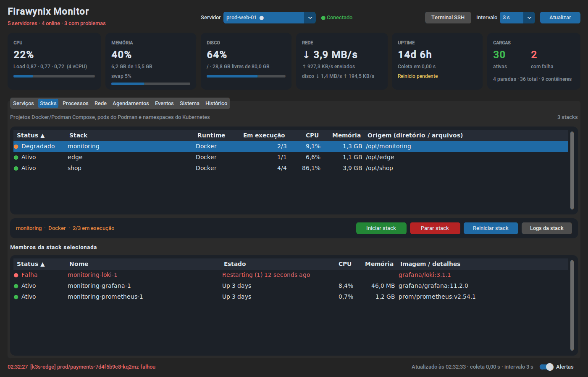

# Firawynix Monitor

Aplicação desktop para **Windows** que monitora e gerencia, em tempo real, servidores
Linux: serviços e demais unidades **systemd**, contêineres **Docker** e **Podman**,
stacks do **Compose**, pods **Kubernetes** (inclusive k3s/microk8s), **VMs libvirt/KVM**,
processos, portas, agendamentos, eventos do journal e a saúde do host, com
**histórico em gráficos**. Não instala nenhum agente nos servidores: tudo acontece por
**SSH** (Paramiko), com autenticação por chave.


## Recursos

| Área | O que faz |
|---|---|
| **Visão geral** | Todos os servidores lado a lado (saúde, CPU, memória, disco, load, rede, uptime, cargas ativas/falhas, contêineres/pods/VMs, alertas) e uma lista única de **problemas em todos os servidores**; duplo clique leva ao item |
| **Serviços** | Unidades systemd (`service`, `timer`, `socket`, `mount`, `path`), contêineres Docker/Podman, pods Kubernetes e VMs em uma só tabela, com CPU/memória por serviço (cgroup v2) e por contêiner (`stats`); filtros por status e tipo, busca e ordenação |
| **Stacks** | Projetos do Docker/Podman **Compose**, pods do Podman e namespaces do Kubernetes, com status agregado (ativo/degradado/falha), membros, diretório/arquivos do Compose e ações na stack inteira |
| **Processos** | Top N por CPU (CPU instantânea via `/proc`), memória, RSS, tempo, linha de comando; encerrar com TERM/KILL (desativado por padrão) |
| **Rede** | Taxas por interface (física/virtual), portas em escuta com processo e exposição (todas as interfaces / local), conexões TCP/UDP |
| **Agendamentos** | Timers do systemd (próxima/última execução) e entradas de cron (usuário, `/etc/crontab`, `/etc/cron.d`, `cron.daily`…) |
| **Eventos** | Erros do journal nas últimas N horas (`journalctl -p err -o json`), com busca e detalhes |
| **Sistema** | SO, kernel, CPU, virtualização, boot, IPs, reinício pendente, **atualizações pendentes** (apt/dnf/yum/apk/zypper, só cache local), **falhas de login SSH (24 h)**, temperaturas, discos com uso de **inodes**, E/S por disco, estado de cada runtime |
| **Histórico** | Gráficos de CPU/memória/disco, load, rede e E/S de disco (15 min a 7 dias), gravados em SQLite local; crosshair com tooltip e exportação CSV |
| **Ações** | Iniciar/Parar/Reiniciar (unidades, contêineres, VMs), reiniciar pod (recriar), ações em stacks inteiras, logs/detalhes em janela modal, **Terminal SSH** em um clique |
| **Alertas** | Toasts do Windows quando um item crítico falha/recupera, um servidor cai ou volta, ou **CPU/memória/disco passam do limite** (com persistência e histerese); ícone na bandeja muda de cor |
| **Exportação** | Qualquer tabela para CSV (botão direito → *Exportar tabela*), pronto para o Excel |
| **Resiliência** | Uma thread por servidor, coletores em paralelo, reconexão com *exponential backoff*, **timeout máximo de 5 s por comando**, keepalive e watchdog |

| Visão geral | Stacks | Histórico |
|---|---|---|
|  |  |  |

## Arquitetura

```
firawynix-monitor/
├── main.py                 # ponto de entrada: CLI, logging, instância única, ciclo de vida
├── config/
│   └── settings.py         # carrega e valida servers.json (+ .env); diretórios da aplicação
├── core/
│   ├── models.py           # dataclasses imutáveis (cargas, stacks, métricas, eventos)
│   ├── commands.py         # construtores de comandos remotos (validação + shlex.quote + sudo -n)
│   ├── parsers.py          # parsers de systemctl, docker/podman, kubectl, virsh, /proc, ss, cron, journal…
│   ├── ssh_client.py       # conexão Paramiko, execução com timeout rígido, operações de alto nível
│   ├── monitor.py          # ServerMonitor (thread por servidor, camadas de coleta), alertas, MonitorManager
│   ├── history.py          # histórico em SQLite com retenção e agregação
│   ├── notifier.py         # toasts do Windows com fallback e cooldown
│   └── demo.py             # servidores simulados (--demo)
├── ui/
│   ├── dashboard.py        # janela principal, cartões, eventos, alertas, bandeja, terminal
│   ├── tabs.py             # abas (Serviços, Stacks, Processos, Rede, Agendamentos, Eventos, Sistema, Histórico)
│   ├── widgets.py          # tabela genérica, cartões, diálogos, visualizador de texto, gráfico de linhas
│   └── tray.py             # ícone da bandeja e geração dos ícones
├── tests/                  # pytest
├── docs/sudoers.example    # regras NOPASSWD restritas
├── FirawynixMonitor.spec   # PyInstaller
├── scripts/build.ps1       # build do .exe em um comando
├── requirements.txt        # dependências de execução congeladas
└── requirements-dev.txt    # + testes e empacotamento (também congeladas)
```

### Coleta em camadas

Cada ciclo executa **em paralelo** (canais SSH distintos na mesma conexão) os coletores
que estiverem vencidos. Cada comando continua limitado a 5 s.

| Camada | Frequência (padrão) | O que coleta |
|---|---|---|
| Rápida | `poll_interval_seconds` (5 s) | unidades systemd, CPU/memória por serviço (cgroup v2), Docker, Podman, pods, VMs, métricas do host (CPU, load, memória, discos, rede, E/S) |
| Detalhes | `detail_interval_seconds` (15 s) | processos, portas, `docker/podman stats` |
| Inventário | `inventory_interval_seconds` (60 s) | sistema, timers, cron, eventos do journal, falhas de login SSH |
| Atualizações | `updates_interval_seconds` (30 min) | pacotes pendentes (somente cache local, nunca acessa a rede) |

"Atualizar" (F5) força todas as camadas. Runtimes ausentes em modo `auto` (ex.: servidor
sem Kubernetes) são re-testados só a cada 12 ciclos.

### Fluxo de dados e threads

```
 ┌──────────────── thread por servidor ─────────────────┐
 │ ServerMonitor: conecta (backoff) → coleta em paralelo │──┐  eventos
 │ → compara → alertas → histórico (SQLite)             │  │ (queue.Queue)
 └──────────────────────────────────────────────────────┘  │
 ┌──────────── ThreadPoolExecutor (ações e logs) ────────┐  │
 │ start/stop/restart, stacks, kill, logs                │──┤
 └──────────────────────────────────────────────────────┘  ▼
                                   Dashboard._pump() a cada 100 ms (thread da UI)
 pystray (thread própria) ── call_in_ui() ───────────────▲
```

* A interface **nunca** executa SSH: ela só consome eventos e *futures*. Só a aba visível
  é redesenhada.
* Um comando que passa de 5 s é abortado; os dados anteriores continuam na tela com
  aviso. Três ciclos seguidos com timeout nos coletores rápidos derrubam a conexão e o
  monitor reconecta. Um *watchdog* fecha o transporte se o servidor travar no meio do
  protocolo SSH.
* Falhas de autenticação ou de chave de host usam backoff longo (30 s → 10 min) para não
  disparar o fail2ban.

## Requisitos

* Windows 10 ou 11 (x64)
* Python **3.11+** (todas as dependências têm wheels Windows para 3.11–3.14) — apenas
  para rodar a partir do código-fonte ou gerar o `.exe`
* Nos servidores: OpenSSH e `systemd`. Docker, Podman, Kubernetes, libvirt, `ss`,
  `crontab` etc. são detectados automaticamente e usados quando existirem. Nada é
  instalado neles.
* Para o botão **Terminal SSH**: o *Cliente OpenSSH* do Windows (já vem no Windows 10
  1809+ e 11). Com o Windows Terminal instalado, abre uma nova aba nele.

## Instalação (código-fonte)

```powershell
git clone https://github.com/firawynix/firawynix-monitor.git
cd firawynix-monitor
py -3.12 -m venv .venv
.\.venv\Scripts\Activate.ps1
python -m pip install --upgrade pip
pip install -r requirements.txt

Copy-Item servers.example.json servers.json   # edite com seus servidores
python main.py
```

Quer só conhecer a interface? `python main.py --demo` usa cinco servidores simulados
(web com stacks Compose, banco com Podman, cluster k3s, hipervisor com VMs e um servidor
offline) e histórico de exemplo.

### Opções de linha de comando

| Opção | Efeito |
|---|---|
| `--config CAMINHO` | Usa outro `servers.json` |
| `--minimized` | Inicia oculto na bandeja (útil na inicialização do Windows) |
| `--demo` | Servidores simulados, sem SSH |
| `--debug` | Log detalhado |
| `--version` | Mostra a versão |

## Configuração

### Onde fica o `servers.json`

Procurado nesta ordem: `--config` → variável `FIRAWYNIX_CONFIG` → pasta do executável
(ou raiz do projeto) → pasta atual → `%APPDATA%\FirawynixMonitor\servers.json`.

O arquivo completo e comentado está em [`servers.example.json`](servers.example.json).
Chaves desconhecidas geram erro (um `"usename"` digitado errado não passa despercebido) e
todos os problemas são listados de uma vez ao iniciar.

### `settings`

| Campo | Padrão | Descrição |
|---|---|---|
| `poll_interval_seconds` | `5` | Camada rápida (2–3600 s). Também pode ser trocado na interface |
| `detail_interval_seconds` | `15` | Processos, portas e stats de contêineres |
| `inventory_interval_seconds` | `60` | Sistema, timers, cron, eventos |
| `updates_interval_seconds` | `1800` | Contagem de atualizações pendentes |
| `command_timeout_seconds` | `5` | Timeout de cada comando SSH. **Máximo 5** |
| `connect_timeout_seconds` | `5` | Timeout de conexão/handshake/autenticação |
| `minimize_to_tray` | `true` | Fechar a janela mantém o monitor na bandeja |
| `start_minimized` | `false` | Inicia oculto na bandeja |
| `appearance_mode` | `"dark"` | `dark`, `light` ou `system` |
| `log_lines` | `50` | Linhas iniciais no modal de logs |
| `process_limit` | `200` | Quantos processos (top por CPU) exibir |
| `known_hosts_file` | `%LOCALAPPDATA%\FirawynixMonitor\known_hosts` | Onde as chaves de host aceitas são gravadas |
| `notifications.enabled` | `true` | Liga/desliga os toasts |
| `notifications.notify_on_recovery` | `true` | Avisa quando algo se recupera |
| `notifications.notify_on_disconnect` | `true` | Avisa quando um servidor fica inacessível |
| `notifications.alert_on_stop` | `false` | Também alerta quando um item crítico **para** (sem falhar). Paradas feitas pelo próprio monitor não geram alerta |
| `notifications.cooldown_seconds` | `120` | Intervalo mínimo entre alertas iguais |
| `notifications.app_id` | — | AppUserModelID dos toasts (opcional) |
| `thresholds.cpu_percent` | `90` | Alerta de CPU (0 desativa) |
| `thresholds.mem_percent` | `90` | Alerta de memória (0 desativa) |
| `thresholds.disk_percent` | `90` | Alerta por partição (0 desativa) |
| `thresholds.sustain_polls` | `3` | Coletas seguidas acima do limite antes de alertar CPU/memória (disco alerta na hora). Só "normaliza" 5 pontos abaixo do limite |
| `history.enabled` | `true` | Grava o histórico dos gráficos |
| `history.retention_days` | `7` | Retenção do histórico |
| `history.file` | `%LOCALAPPDATA%\FirawynixMonitor\history.sqlite3` | Arquivo do histórico |
| `events.priority` | `"err"` | Prioridade máxima dos eventos do journal (`emerg`…`notice`) |
| `events.limit` / `events.since_hours` | `100` / `24` | Quantidade e janela dos eventos |

### `servers[]`

| Campo | Padrão | Descrição |
|---|---|---|
| `name` | — | Nome exibido (único) |
| `host` / `port` | — / `22` | Endereço SSH |
| `username` | — | Usuário SSH (recomendado: usuário dedicado, ex. `monitor`) |
| `key_file` | — | Chave privada (`~` e `%VAR%` são expandidos). Sem ela, usa o agente SSH e as chaves padrão de `~/.ssh` |
| `key_passphrase_env` / `password_env` | — | **Nome** da variável de ambiente com a passphrase / senha |
| `allow_agent` / `look_for_keys` | `true` | Usa o agente (OpenSSH do Windows / Pageant) e as chaves padrão |
| `host_key_policy` | `"accept-new"` | `accept-new` (TOFU, como o OpenSSH) ou `strict`. Chave **diferente** da gravada é sempre recusada |
| `unit_types` | todos | Tipos de unidade systemd coletados: `service`, `timer`, `socket`, `mount`, `path` |
| `use_sudo` | `true` | `sudo -n` para iniciar/parar/reiniciar unidades (ignorado se `username` for `root`) |
| `docker` / `docker_sudo` | `"auto"` / `false` | `auto` (detecta), `on` (avisa se indisponível) ou `off`; sudo para o Docker |
| `podman` / `podman_sudo` | `"auto"` / `false` | Idem para o Podman (rootless funciona sem sudo) |
| `kubernetes` | `"auto"` | Pods via `kubectl` |
| `kubectl_command` | `"kubectl"` | Ex.: `"k3s kubectl"`, `"microk8s kubectl"` ou caminho absoluto |
| `kubectl_sudo` | `false` | Necessário no k3s (kubeconfig só legível pelo root) |
| `libvirt` / `libvirt_uri` / `libvirt_sudo` | `"auto"` / `"qemu:///system"` / `false` | VMs via `virsh` |
| `logs_sudo` | `false` | `sudo -n` com o `journalctl` |
| `network_sudo` | `false` | `sudo -n ss -tulnp` para ver o processo dono de todas as portas |
| `process_actions` | `false` | Habilita encerrar processos (TERM/KILL) |
| `process_sudo` | `false` | `sudo -n kill` (**não recomendado**: permite encerrar qualquer processo) |
| `poll_interval_seconds` | global | Intervalo específico deste servidor |
| `critical_services` | `["*"]` | Padrões *glob* dos itens que geram alerta. `nginx` casa com `nginx.service`; prefixos restringem o tipo: `systemd:`, `docker:`, `podman:`, `k8s:` (ex.: `k8s:prod/*`), `vm:` |
| `exclude_services` | `[]` | Padrões ocultados da tabela e dos alertas |

### Segredos (`.env`)

Senhas e passphrases **nunca** ficam no `servers.json` — chaves como `password`,
`passphrase` ou `sudo_password` são recusadas. Informe apenas o **nome** da variável e
defina o valor nas variáveis de ambiente do Windows ou em um `.env` ao lado do
`servers.json`/executável (veja [`.env.example`](.env.example)).

## Preparando os servidores Linux

1. **Usuário dedicado com chave:**

   ```bash
   sudo useradd -m -s /bin/bash monitor
   sudo -u monitor mkdir -m 700 -p ~monitor/.ssh
   # chave pública gerada no Windows com: ssh-keygen -t ed25519
   sudo -u monitor tee -a ~monitor/.ssh/authorized_keys < id_ed25519.pub
   sudo chmod 600 ~monitor/.ssh/authorized_keys
   ```

2. **Leitura sem sudo (preferível):**

   ```bash
   sudo usermod -aG systemd-journal monitor   # logs, eventos e falhas de login SSH
   sudo usermod -aG libvirt monitor           # VMs (se houver)
   sudo usermod -aG docker monitor            # ATENÇÃO: grupo docker ≈ acesso root
   ```

3. **Ações sem senha, apenas para os comandos necessários** — o monitor usa `sudo -n`
   (não interativo) e **nunca** envia senha ao sudo. Crie
   `/etc/sudoers.d/firawynix-monitor` com `sudo visudo -f /etc/sudoers.d/firawynix-monitor`
   a partir de [`docs/sudoers.example`](docs/sudoers.example), que lista o comando exato
   de cada opção. Exemplo mínimo:

   ```sudoers
   Cmnd_Alias FWX_NGINX = /usr/bin/systemctl --no-block start nginx.service, \
                          /usr/bin/systemctl --no-block stop nginx.service, \
                          /usr/bin/systemctl --no-block restart nginx.service
   monitor ALL=(root) NOPASSWD: FWX_NGINX
   ```

   Ações usam `--no-block` (systemd) e `-t 3` (contêineres) para caber no limite de 5 s;
   o que demorar mais aparece como **Iniciando** na coleta seguinte.

4. **CPU/memória por serviço** exigem cgroup v2 (Ubuntu 22.04+, Debian 11+, RHEL 9+);
   em cgroup v1 essas colunas ficam vazias e o resto funciona normalmente.

## Uso

* **Servidor**: *Visão geral* mostra todos; escolha um servidor para as abas. Um `●` ao
  lado do nome indica problema. Na visão geral, duplo clique em um servidor ou problema
  abre o item correspondente.
* **Tabelas**: clique nos cabeçalhos para ordenar; botão direito para ações, *Copiar
  linha* e *Exportar tabela (CSV)*. Duplo clique abre logs/detalhes.
* **Busca**: `Ctrl+F` na aba atual (`Esc` limpa). Vários termos são combinados com "E".
* **Stacks**: selecione uma stack para ver os membros; as ações valem para todos os
  contêineres dela. Namespaces do Kubernetes são somente leitura aqui (reinicie os pods
  individualmente na aba Serviços).
* **Pods**: *Reiniciar* exclui o pod para o controlador recriá-lo (Deployment,
  StatefulSet…). Iniciar/Parar não se aplicam.
* **VMs**: *Parar* envia desligamento ACPI (`virsh shutdown`), nunca `destroy`; *Ver
  logs* mostra `virsh dominfo`/discos/IPs.
* **Terminal SSH**: abre `ssh usuario@host` (com a chave configurada) no Windows
  Terminal ou em um console novo.
* `F5` força uma coleta completa. O switch *Alertas* (e o menu da bandeja) silencia os
  toasts.
* **Bandeja**: fechar a janela mantém o monitor rodando. Verde = tudo OK, amarelo =
  avisos, vermelho = item crítico com falha ou servidor inacessível, cinza = conectando.
* **Logs da aplicação**: `%LOCALAPPDATA%\FirawynixMonitor\logs\monitor.log`.

## Empacotamento (`.exe` com PyInstaller)

```powershell
powershell -ExecutionPolicy Bypass -File scripts\build.ps1
```

O script cria `.venv`, instala `requirements-dev.txt`, roda os testes e gera
**`dist\FirawynixMonitor.exe`** (arquivo único, sem console, com ícone e versão).
Manualmente: `pip install -r requirements-dev.txt` e
`pyinstaller --noconfirm --clean FirawynixMonitor.spec`. Distribua o `.exe` com um
`servers.json` na mesma pasta.

**Iniciar junto com o Windows** (minimizado na bandeja):

```powershell
$exe = (Resolve-Path dist\FirawynixMonitor.exe).Path
$lnk = Join-Path ([Environment]::GetFolderPath("Startup")) "Firawynix Monitor.lnk"
$s = (New-Object -ComObject WScript.Shell).CreateShortcut($lnk)
$s.TargetPath = $exe; $s.Arguments = "--minimized"; $s.WorkingDirectory = Split-Path $exe
$s.Save()
```

## Segurança

* **Sem agente**: nada é instalado nos servidores; somente comandos de leitura e as ações
  explicitamente confirmadas pelo usuário.
* **Sem segredos em texto plano**: `servers.json` só referencia variáveis de ambiente.
* **Sem senha de sudo**: sempre `sudo -n`; libere o mínimo via sudoers (NOPASSWD).
* **Chaves de host verificadas**: TOFU (`accept-new`) ou `strict`; chave divergente é
  recusada com alerta de possível *man-in-the-middle*.
* **Sem injeção de comandos**: nomes de unidades, contêineres, pods e VMs passam por
  whitelist (nunca começam com `-`), PIDs são validados (PID 1 nunca), `kubectl_command`
  e `libvirt_uri` são validados na configuração, e todo valor passa por `shlex.quote`; os
  comandos rodam via `sh -c` com `LC_ALL=C`.
* **Ações destrutivas desligadas por padrão**: encerrar processos exige
  `process_actions: true`; toda ação pede confirmação.
* **Atualizações só pelo cache local**: nenhum comando do monitor baixa nada da internet.
* **Instância única** (mutex do Windows) e logs sem credenciais.

## Testes

```powershell
pip install -r requirements-dev.txt
python -m pytest
```

Cobrem os parsers (formatos modernos e legados de `systemctl`, `docker`/`podman`,
`kubectl`, `virsh`, `/proc/*`, `ss` e o fallback `/proc/net`, `free`, `df`, cron,
journal JSON, inventário), os construtores de comando (incluindo tentativas de injeção
e validação de sintaxe POSIX de cada comando composto), a validação da configuração, as
políticas de alerta e de limites, o histórico em SQLite e o loop do monitor (camadas,
reconexão, perda de conexão, timeouts) com um cliente SSH falso.

## Solução de problemas

| Sintoma | Causa / solução |
|---|---|
| "O sudo exigiu senha" | O comando não está liberado com NOPASSWD. Confira o caminho (`command -v systemctl`) e o texto exato em `docs/sudoers.example` |
| "Interactive authentication required" | `use_sudo` desligado e o polkit negou. Ligue `use_sudo` e configure o sudoers |
| Logs/eventos incompletos, "Journal parcial" | Adicione o usuário ao grupo `systemd-journal` (ou use `logs_sudo`) |
| "Sem permissão no socket do Docker/Podman" | Grupo `docker`, Podman rootless, ou `docker_sudo`/`podman_sudo` |
| "kubectl sem kubeconfig" / sem permissão | No k3s use `"kubectl_command": "k3s kubectl"` com `kubectl_sudo: true`; em outros clusters, configure o kubeconfig do usuário SSH |
| "Sem permissão no libvirt" | `sudo usermod -aG libvirt monitor` ou `libvirt_sudo` |
| Portas sem processo | Processos de outros usuários exigem `network_sudo: true` |
| Colunas CPU/Memória vazias para serviços | O servidor usa cgroup v1 |
| "A chave SSH ... MUDOU" | Servidor reinstalado ou interceptação. Se legítimo, remova a linha do host em `%LOCALAPPDATA%\FirawynixMonitor\known_hosts` (e em `~/.ssh/known_hosts`) |
| Aviso "não respondeu a tempo" | Servidor sobrecarregado; os últimos dados continuam visíveis. Após 3 ciclos com timeout o monitor reconecta |
| Terminal SSH não abre | Instale o *Cliente OpenSSH* (Configurações > Aplicativos > Recursos opcionais); o comando é copiado para a área de transferência |
| Toasts não aparecem | Verifique *Configurações > Sistema > Notificações* e o *Não incomodar*. Para outro nome de aplicativo, defina `notifications.app_id` com um AppUserModelID registrado |

## Atualizando dependências

As versões em `requirements*.txt` são exatas (incluindo as transitivas) para builds
reprodutíveis. Para atualizar:

```powershell
python -m venv .venv-upd; .\.venv-upd\Scripts\Activate.ps1
pip install customtkinter paramiko pystray Pillow win11toast plyer python-dotenv pytest pyinstaller
pip freeze   # atualize os pinos de requirements.txt / requirements-dev.txt
python -m pytest
```
